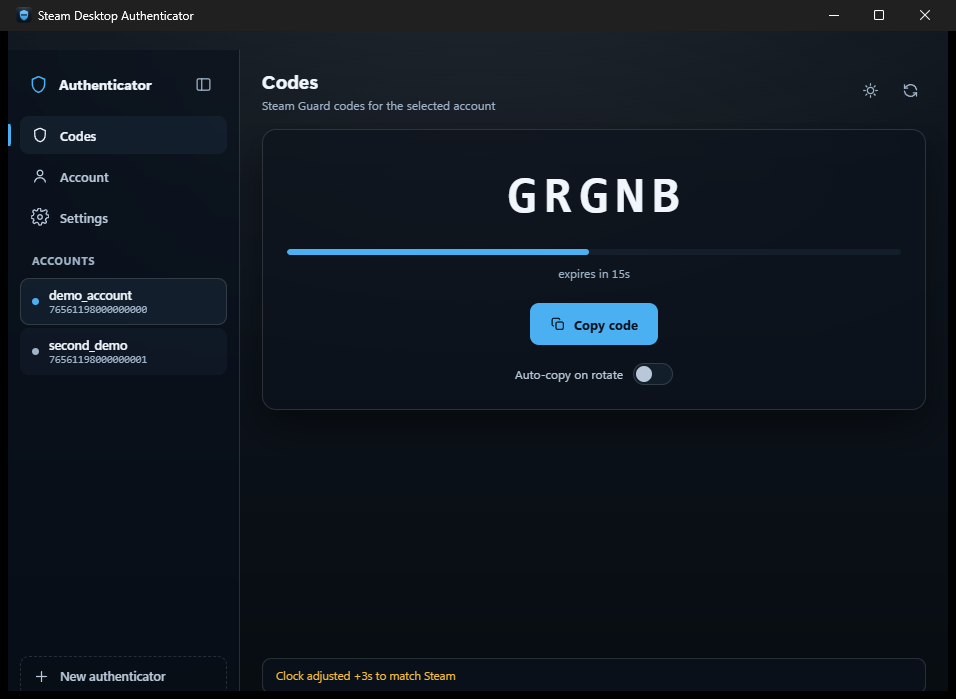

# Steam Desktop Authenticator

A Steam Guard authenticator for Windows. It shows the same rotating
five-character code the phone app does, and can attach a brand-new
authenticator to a Steam account, producing a standard `.maFile`.

Built with [Tauri 2](https://v2.tauri.app) — a Rust backend and the system
WebView2 — so the whole thing is about 8 MB and your secrets never leave Rust.



## Download

Grab the latest build from
[**Releases**](https://github.com/zewj/steam-desktop-authenticator/releases/latest):

| File | Use |
| --- | --- |
| `…-x64-setup.exe` | Installer, adds a Start menu entry |
| `…-x64-portable.exe` | Run it directly, no install |

Needs Windows 10 or 11 with WebView2, which ships with Windows 11 and current
Windows 10. SHA256 checksums are published with each release.

The binaries are **not code-signed**, so SmartScreen will warn on first run.
That is expected for unsigned open-source software; verify the checksum if you
want certainty, or build from source below.

## What it does

- Rotating Steam Guard codes with a countdown, click-to-copy, and optional
  auto-copy as each code rolls over.
- **Creates new authenticators.** Signs in, handles the Steam Guard step, has
  Steam mint the secrets, shows the revocation code, then activates with the
  code Steam sends you.
- Reads existing `.maFile`s, including the encrypted-at-rest format the
  original SDA writes (AES-256-CBC over a PBKDF2-SHA1 key).
- Multiple accounts in a collapsible sidebar.
- Light and dark themes, following Windows by default.
- Corrects for clock drift against Steam's time API — a local clock off by
  ~30 seconds produces codes Steam rejects.
- Fully keyboard operable, and it respects reduced-motion and high-contrast
  settings.

## Creating an authenticator

**File ▸ New authenticator** walks through it. Before you start:

- **Write down the revocation code** (`R#####`) when it appears. It is the only
  way to detach the authenticator if you lose the file, and Steam shows it
  once. The `.maFile` is written and flushed to disk *before* activation, so
  the code survives even if activation then fails.
- Any authenticator **currently on your phone will be replaced**. Steam allows
  one per account.
- A phone number is **not** required. Steam sends the activation code by SMS
  when a phone is attached and by email when one is not.

Your password is used for the single login call and is never written to disk.

## Where it looks for accounts

On startup it checks, in order: a `maFiles` folder beside the executable or any
parent of it, any folder on your Desktop containing a `maFiles` child, then
`%USERPROFILE%\maFiles` and `%APPDATA%\SteamDesktopAuthenticator\maFiles`.

Whichever folder your accounts actually loaded from is remembered, so pointing
it somewhere with **Settings ▸ Open folder** sticks across launches. That
matters for the portable build, which is otherwise nowhere near your files.

Files it creates carry a `manifest.json`, so the original SDA can read them too.

## Known limitations

- **Trade and market confirmations do not work.** The code is written and
  tested but the section is disabled, because Steam will not grant this app a
  `steamcommunity.com` session using the token saved at enrollment — `EResult
  15` from both `GenerateAccessTokenForApp` and `login.steampowered.com/jwt/finalizelogin`,
  and `needauth` when the refresh token is used directly as `steamLoginSecure`.
  Finishing it needs the app to perform its own web login. Approve trades from
  the phone app for now.
- The enrollment flow's offline parts are well covered by tests, but **the live
  conversation with Steam is not automatically tested** — that needs real
  credentials and an activation code. It has been run successfully against live
  Steam; treat your first run as the real test.
- Windows only, though little here is inherently Windows-bound beyond the
  packaging.

## Security design

Your `shared_secret` is a permanent second factor for the account — treat a
`.maFile` like a password.

Secrets stay in the Rust backend and never cross the IPC boundary. The webview
receives finished codes and account metadata only; `mafile::AccountView` exists
so a secret cannot be serialised to the frontend by accident, and a test
asserts exactly that.

That is also the reason for Tauri over Electron. Electron runs Node in the
renderer, so anything achieving script execution in the UI gets the filesystem
with it, and the npm dependency tree becomes supply-chain surface for a process
that reads your 2FA secrets. Here the webview is the OS WebView2, which means
Chromium security fixes arrive through Windows Update rather than needing a new
build of this app.

Capabilities are narrowed in `src-tauri/capabilities/default.json` to file-open
dialogs, clipboard write and theme setting. A strict CSP is set in
`tauri.conf.json`; the Tauri scaffold ships `"csp": null`, which disables it.

## Building

```
npm install
npm run tauri dev      # develop
npm run tauri build    # release + installer
cd src-tauri && cargo test
```

Needs Rust and the MSVC toolchain. `cargo test -- --ignored` additionally runs
two live checks against Steam's public endpoints, using an invalid account and
no credentials; they exist to catch transport regressions the offline tests
cannot see.

## Correctness

Code generation is pinned to test vectors cross-checked against an independent
.NET HMAC-SHA1 implementation, so the codes are provably right rather than
merely plausible. Steam uses RFC 6238 TOTP with a 30-second step, then renders
the truncated value in base-26 over `23456789BCDFGHJKMNPQRTVWXY` — characters
that cannot be confused with each other.

31 Rust tests cover code generation, `.maFile` reading including the encrypted
format, RSA password encryption, confirmation signing, and Steam's error
contract: failures arrive as **HTTP 200 with an empty body** and the real code
in an `X-eresult` header, which a client reading only the body sees as an empty
success.

`check-contrast.py` verifies the palette independently. Text on a translucent
panel sits on a composite of background, wash and panel, so it checks every
colour against both extremes of that range in both themes rather than trusting
the eye.

## Acknowledgements

Inspired by the original
[Steam Desktop Authenticator](https://github.com/Jessecar96/SteamDesktopAuthenticator).
This is an independent implementation, not derived from its code.
